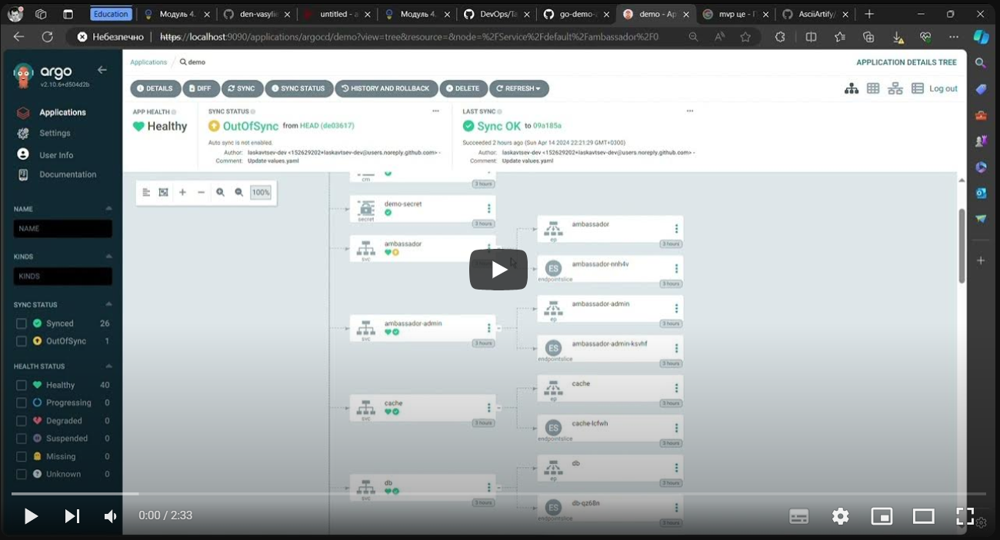

# Minimal Viable Product
### Нижче представлена демонстрація роботи програми в середовищі Kubernetes:

### Демонстрація роботи інтерфейса ArgoCD і його реакції на зміни вихідного коду

### Скріншоти налаштування застосунку на синхронізацію з репозиторієм https://github.com/den-vasyliev/go-demo-app та налаштованої автоматичної синхронізації

