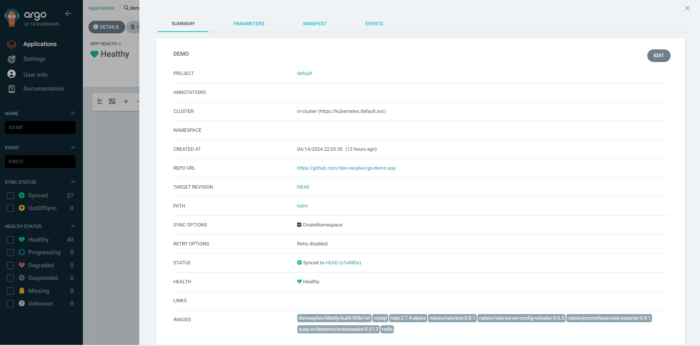
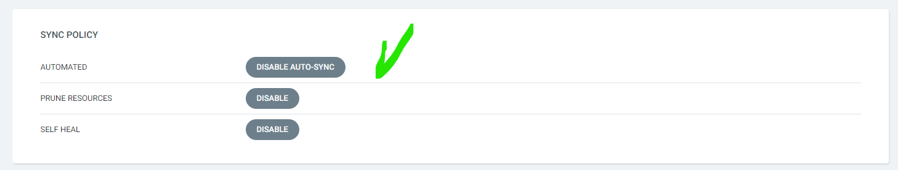
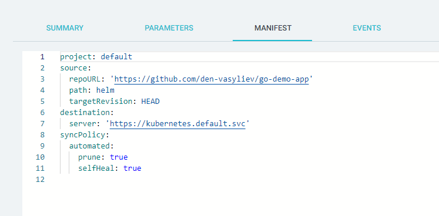
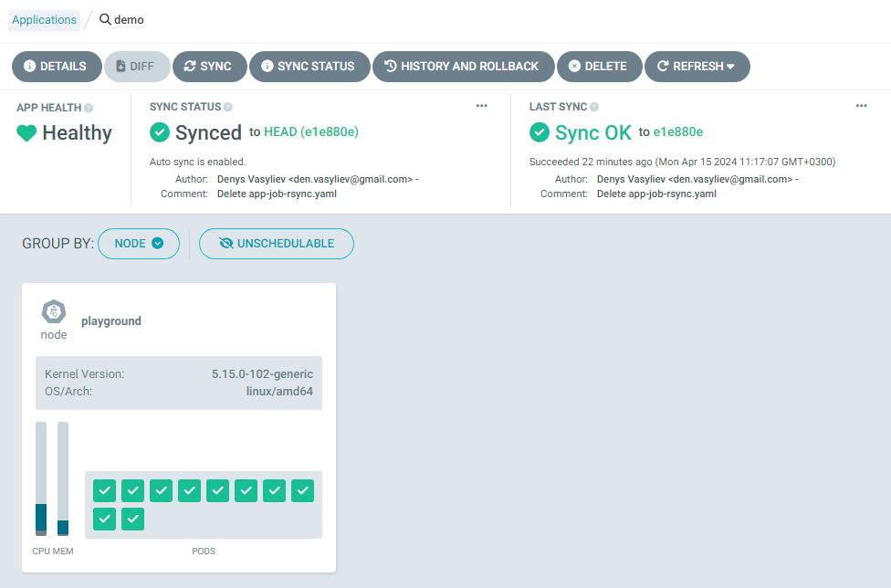

# Minimal Viable Product
### Нижче представлена демонстрація роботи програми в середовищі Kubernetes:

#### 1) Перевіряємо наявні сервіси:
```bash
$ k get svc
```
#### 2) Нас цікавить сервіс із назвою ambassador. Активуємо для нього порт:
```bash
$ k get svc
```
### Демонстрація роботи інтерфейса ArgoCD і його реакції на зміни вихідного коду

[](https://youtu.be/jwjv506laSo)

### Скріншоти налаштування застосунку на синхронізацію з репозиторієм https://github.com/den-vasyliev/go-demo-app та налаштованої автоматичної синхронізації




