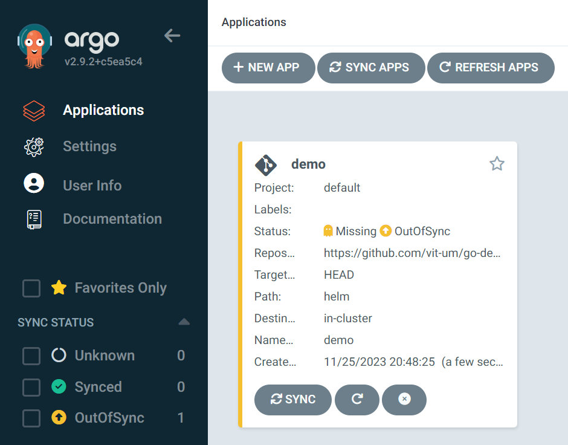
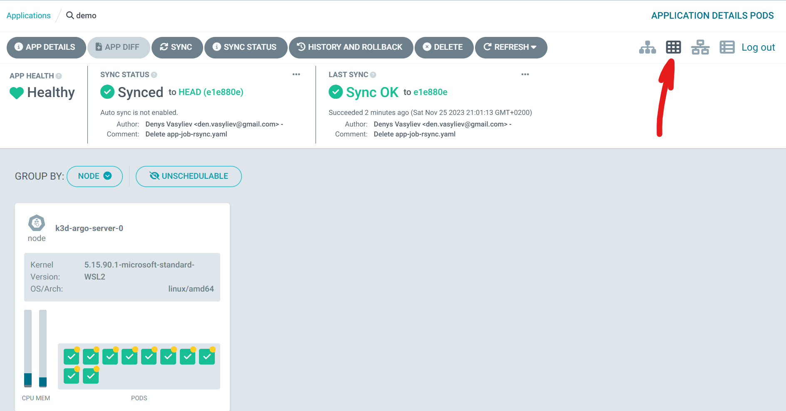
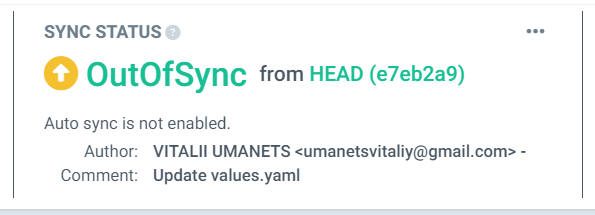

## Proof of Concept. ArgoCD

`Мета:`Доведемо, що реалізація ідеї є технічно можливою.

`Зміст документації:`В документації описано концепцію, аналіз технічних можливостей, вибір технологічного стеку, план виконання, технічні сценарії та метрики успіху PoC.

Розглядаємо інструменти для розгортання застосунків. Почнемо з [репозиторію](https://github.com/laskavtsev-dev/AsciiArtify) для автоматизації процесу CI. Для CD використовуємо підхід "one application - one cluster" з "single host kubernetes cluster". Системою Delivery і Deploy обрано ArgoCD.

  

`ArgoCD` реалізує підхід GitOps використовуючи репозиторій Git як джерело істини для визначення бажаного стану програми. Маніфести Kubernetes можна вказувати кількома способами:  
- [kustomize](https://kustomize.io/) applications  
- [helm](https://helm.sh/) charts
- [jsonnet](https://jsonnet.org/) files
- Plain directory of YAML/json manifests  

`ArgoCD`- це контролер Kubernetes який безперервно відстежує запущені додатки та порівнює поточний стан з бажаним. Деплоймент поточній стан якого відрізняється від цільового вважається `out of sync` ArgoCD інформує та візуалізує відмінності надаючи можливості для автоматичної або ручної синхронізації бажаного стану. 

1. Підготуємо в окремий локальний кластер для встановлення ArgoCD. Налаштуємо його:  
```bash
$ k3d cluster create argo
... 
INFO[0029] Cluster 'argo' created successfully!         
INFO[0029] You can now use it like this: kubectl cluster-info

$ kubectl cluster-info
Kubernetes control plane is running at https://127.0.0.1:6443
CoreDNS is running at https://127.0.0.1:6443/api/v1/namespaces/kube-system/services/kube-dns:dns/proxy
Metrics-server is running at https://127.0.0.1:6443/api/v1/namespaces/kube-system/services/https:metrics-server:https/roxy

$ alias k='kubectl'

$ k version
Client Version: v1.28.7+k3s1
Kustomize Version: v5.0.4-0.20230601165947-6ce0bf390ce3
Server Version: v1.28.7+k3s1

$ k get all -A
NAMESPACE     NAME                                           READY   STATUS      RESTARTS      AGE
kube-system   pod/helm-install-traefik-b6jz6                 0/1     Completed   1             21d
kube-system   pod/helm-install-traefik-crd-5bglq             0/1     Completed   0             21d
kube-system   pod/svclb-traefik-7153cac8-dh655               2/2     Running     8 (20h ago)   21d
kube-system   pod/traefik-f4564c4f4-jkbg6                    1/1     Running     4 (20h ago)   21d
kube-system   pod/coredns-6799fbcd5-bzw2j                    1/1     Running     4 (20h ago)   21d
kube-system   pod/local-path-provisioner-6c86858495-gpth9    1/1     Running     7 (20h ago)   21d
kube-system   pod/metrics-server-67c658944b-7jtmr            1/1     Running     7 (20h ago)   21d
kube-system   pod/svclb-hello-world-service-3f2e8768-vzg95   0/1     Pending     0             19h
default       pod/demo-777c97f498-822vb                      1/1     Running     0             19h
default       pod/hello-world-7879445f4-8gq4l                1/1     Running     0             3h16m
kube-system   pod/svclb-hello-world-b07a870b-8vbjx           1/1     Running     0             3h16m

NAMESPACE     NAME                          TYPE           CLUSTER-IP      EXTERNAL-IP    PORT(S)                      AGE
default       service/kubernetes            ClusterIP      10.43.0.1       <none>         443/TCP                      21d
kube-system   service/kube-dns              ClusterIP      10.43.0.10      <none>         53/UDP,53/TCP,9153/TCP       21d
kube-system   service/metrics-server        ClusterIP      10.43.1.65      <none>         443/TCP                      21d
kube-system   service/traefik               LoadBalancer   10.43.123.51    10.10.10.143   80:30894/TCP,443:32606/TCP   21d
default       service/hello-world-service   LoadBalancer   10.43.80.233    <pending>      80:30174/TCP                 19h
default       service/hello-world           LoadBalancer   10.43.116.160   10.10.10.143   8080:30823/TCP               3h16m
NAMESPACE     NAME                                                DESIRED   CURRENT   READY   UP-TO-DATE   AVAILABLE   NODE SELECTOR   AGE
kube-system   daemonset.apps/svclb-traefik-7153cac8               1         1         1       1            1           <none>          21d
kube-system   daemonset.apps/svclb-hello-world-service-3f2e8768   1         1         0       1            0           <none>          19h
kube-system   daemonset.apps/svclb-hello-world-b07a870b           1         1         1       1            1           <none>          3h16m

NAMESPACE     NAME                                     READY   UP-TO-DATE   AVAILABLE   AGE
kube-system   deployment.apps/traefik                  1/1     1            1           21d
kube-system   deployment.apps/coredns                  1/1     1            1           21d
kube-system   deployment.apps/local-path-provisioner   1/1     1            1           21d
kube-system   deployment.apps/metrics-server           1/1     1            1           21d
default       deployment.apps/demo                     1/1     1            1           20d
default       deployment.apps/hello-world              1/1     1            1           3h16m

NAMESPACE     NAME                                                DESIRED   CURRENT   READY   AGE
kube-system   replicaset.apps/traefik-f4564c4f4                   1         1         1       21d
kube-system   replicaset.apps/coredns-6799fbcd5                   1         1         1       21d
kube-system   replicaset.apps/local-path-provisioner-6c86858495   1         1         1       21d
kube-system   replicaset.apps/metrics-server-67c658944b           1         1         1       21d
default       replicaset.apps/demo-777c97f498                     1         1         1       20d
default       replicaset.apps/hello-world-7879445f4               1         1         1       3h16m

NAMESPACE     NAME                                 COMPLETIONS   DURATION   AGE
kube-system   job.batch/helm-install-traefik-crd   1/1           20s        21d
kube-system   job.batch/helm-install-traefik       1/1           22s        21d
```
2. Інсталяція 
Використаємо скрипт з офіційного репозиторію [ArgoCD](https://argo-cd.readthedocs.io/en/stable/#quick-start) Спочатку створимо неймспейс в якому буде встановлено систему, потім скористаємось скриптом (маніфестом) для інсталяції та перевіримо стан системи після встановлення:     
```bash
$ k create namespace argocd
namespace/argocd created

$ k get ns
NAME              STATUS   AGE
kube-system       Active   21d
kube-public       Active   21d
kube-node-lease   Active   21d
default           Active   21d
argocd            Active   17s

$ k apply -n argocd -f https://raw.githubusercontent.com/argoproj/argo-cd/stable/manifests/install.yaml

$ k get all -n argocd

# перевіримо статус контейнерів: 
$ k get pod -n argocd -w
NAME                                                READY   STATUS    RESTARTS   AGE
argocd-redis-66d9777b78-gn62b                       1/1     Running   0          2m48s
argocd-applicationset-controller-6c8fbc69b5-twtfl   1/1     Running   0          2m48s
argocd-notifications-controller-6b66d47b45-n4p79    1/1     Running   0          2m48s
argocd-dex-server-59bd76d76-8fn7n                   1/1     Running   0          2m48s
argocd-repo-server-b9957974f-ddws5                  1/1     Running   0          2m48s
argocd-server-5d8d58455f-lllsr                      1/1     Running   0          2m48s
argocd-application-controller-0                     1/1     Running   0          2m47s
```
3. Отримаємо доступ до інтерфейсу ArgoCD GUI 
[Отримати доступ](https://argo-cd.readthedocs.io/en/stable/getting_started/#3-access-the-argo-cd-api-server) можна в два шляхи:  
- Service Type Load Balancer  
- Ingress  
- Port Forwarding 

Скористаємось `Port Forwarding` за допомогою локального порта 9090. В команді ми посилаємось на сервіс `svc/argocd-server` який знаходиться в namespace `-n argocd`. Kubectl автоматично знайде endpoint сервісу та встановить переадресацію портів з локального порту 9090 на віддалений 443 
```bash
$ k port-forward svc/argocd-server -n argocd 9090:443&
[1] 95905
Forwarding from 127.0.0.1:9090 -> 8080
Forwarding from [::1]:9090 -> 8080
```
ArgoCD за замовчуванням працює з https тому при спробі відкрити [127.0.0.1:9090](https://127.0.0.1:9090/) ми отримаємо помилку сертифікати. Отже в продуктивній системі потрібно встановлювати сертифікати та налаштовувати ці моменти. 

4. Отримання паролю 
Використаємо команду для отримання паролю, вкажемо файл секрету `argocd-initial-admin-secret` а також формат  виводу `jsonpath="{.data.password}"`. Це поверне нам base64 закодований пароль, після чого використаємо команду `base64 -d` для повернення паролю в простий текст. Отриманий пароль та логін `admin` вводимо в Web-інтерфейс ArgoCD   
```bash
$ k -n argocd get secret argocd-initial-admin-secret -o jsonpath="{.data.password}"
YVpGVjlZU2R3b0lrVUNxVg==#                                                                                                        
$ k -n argocd get secret argocd-initial-admin-secret -o jsonpath="{.data.password}"|base64 -d; echo
aZFV9YSdwoIkUCqV
```
5. Створимо додаток за допомогою графічного інтерфейсу. 
Тепер налаштовані в ArgoCD додатки будуть автоматично встановлюватись на оновлятись в Kubernetes. 
- Натискаємо `+ NEW APP` 
- Вводимо ім'я додатку `demo`
- Проект до якого належить додаток оберемо `за замовчуванням`
- Тип синхронізації залишаємо `Manual`
  
- У розділі `SOURCE` тип джерела залишаємо за замовчуванням `GIT`
- Введемо `url` репозиторію, який містить маніфести для розгортання https://github.com/laskavtsev-dev/go-demo-app (це буде helm charts, або пакет маніфестів який являє собою групу об'єктів для Kubernetes та нашого додатку)
- У полі `Path` введемо шлях до каталогу `helm`  
  
- В розділі `DESTINATION` вкажемо `url` локального кластеру та `Namespace` demo після чого ArgoCD автоматично визначить параметри додатку використавши маніфести, які знаходяться в репозиторії. В разі бажання змінити значення вручну можна змінити іх значення в розділі `PARAMETERS`.  
  
- У розділі політика синхронізація вкажемо як додаток буде синхронізуватись з репозиторієм. Тут важливо вказати ArgoCD щоб створив новий namespace так як в helm цю функцію за замовчуванням прибрали. Ставимо галку напроти `AUTO-CREATE NAMESPACE`   
- Створюємо додаток кнопкою `CREATE`  
  

6. Переглянемо деталі розгорнутого застосунку натиснувши на нього в списку.  
Графічний інтерфейс надає ієрархічне уявлення про компоненти програми, їх розгортання та поточний стан у кластері. 

  

7. Синхронізація застосунку 
- Для цього у вікні відомостей про програму натискаємо кнопку `SYNC` 
- Праворуч вискакує вікно в якому потрібно обрати компоненти та режими синхронізації та натиснути кнопку `SYNCHRONIZE`  
- Після завершення процесу можемо перевірити правильність розгортання програми, перевіривши її статус у кластері:  

  

8. Прослідкуємо за реакцією ArgoCD на зміни в репозиторію.
- Змінимо в файлі репозиторію https://github.com/laskavtsev-dev/go-demo-app/blob/master/helm/values.yaml тип шлюзу з `NodePort` на `LoadBalancer` (останній рядок файлу)  



```bash
$ k get svc -n demo
NAME               TYPE        CLUSTER-IP      EXTERNAL-IP   PORT(S)                                                 AGE
demo-nats          ClusterIP   None            <none>        4222/TCP,6222/TCP,8222/TCP,7777/TCP,7422/TCP,7522/TCP   31m
demo-front         ClusterIP   10.43.247.92    <none>        80/TCP                                                  31m
cache              ClusterIP   10.43.234.48    <none>        6379/TCP                                                31m
ambassador         NodePort    10.43.190.212   <none>        80:30092/TCP                                            31m
```
- Викликаний процес синхронізації отримає останню версію репозиторію гіт та порівняє її з поточним станом. Таким чином бачимо що тип сервісу для ambassador змінився з NodePort на LoadBalancer та відповідно був оновлений маніфест Kubernetes
```bath
$ NAME               TYPE           CLUSTER-IP      EXTERNAL-IP   PORT(S)             AGE
ambassador         LoadBalancer   10.43.190.212   <pending>     80:30092/TCP          35m
```
